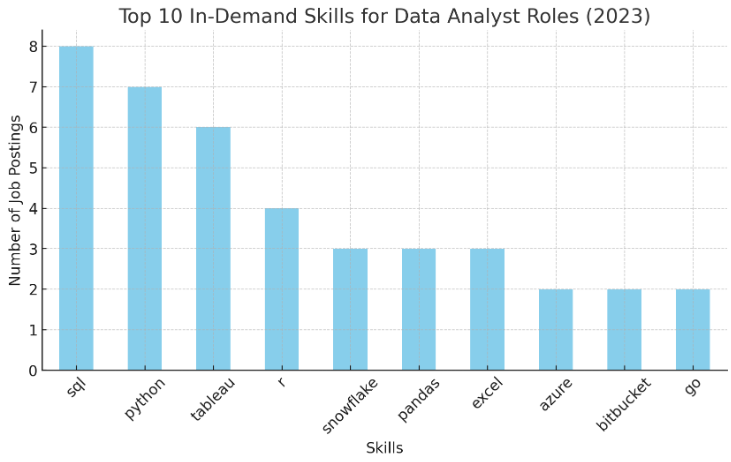

# Job Data Analysis Project 📊

## Introduction

This project aims to analyze job data to identify top-paying jobs, in-demand skills, and optimal skills to learn for specific roles. The analysis is based on job postings data and focuses on the role of a Data Analyst.

## Background

The job market is constantly evolving, and understanding the skills and roles that command high salaries can help professionals make informed career decisions. This project leverages SQL to analyze job postings data and extract valuable insights.

## Tools I Used 🛠️

- **PostgreSQL**: For database management and running SQL queries.
- **SQLTools**: A Visual Studio Code extension for connecting to the PostgreSQL database.
- **CSV files**: Containing job postings data and skills information.

## The Analysis 📈

The analysis is divided into several SQL queries, each addressing a specific question:

1. **Top-Paying Jobs**: Identifies the highest-paying jobs for the role of a Data Analyst. [View Query](/proj/1_topPayingJobs.sql)
2. **Skills for Top-Paying Jobs**: Lists the skills required for the top-paying roles. [View Query](/proj/2_skillsForTopPayingJobs.sql)
3. **In-Demand Skills**: Determines the most in-demand skills for the role. [View Query](/proj/3_inDemandSkillsForRole.sql)
4. **Top Skills Based on Salary**: Identifies the top skills based on average salary. [View Query](/proj/4_topSkillsBasedOnSalary.sql)
5. **Most Optimal Skills to Learn**: Recommends skills that are both high in demand and high paying. [View Query](/proj/5_mostOptimalSkillsToLearn.sql)

### 1. Top-Paying Jobs 💼

To pinpoint the most lucrative positions, I examined data analyst roles, sorting them by average annual salary and work location, focusing on remote jobs. This query highlights the high paying opportunities in the field.

```sql
SELECT company_dim.name as company_name,
    job_title,
    salary_year_avg
FROM job_postings_fact
    LEFT JOIN company_dim ON job_postings_fact.company_id = company_dim.company_id
WHERE job_title_short = 'Data Analyst'
    AND job_location = 'Anywhere'
    AND salary_year_avg IS NOT NULL
ORDER BY salary_year_avg DESC
LIMIT 10;
```

#### Here's the breakdown of the top data analyst jobs in 2023:

- 💰 **Substantial Pay Variation**: The highest-paying data analyst positions range from $184,000 to $650,000, demonstrating considerable earning prospects within the field.
- 🏢 **Varied Hiring Organizations**: Companies such as SmartAsset, Meta, and AT&T are among those offering high salaries, illustrating widespread demand across different industries.
- 📋 **Diversified Job Titles**: There's considerable variety in job titles, from Data Analyst to Director of Analytics, reflecting diverse positions and areas of expertise within data analytics.

### 2. Skills for Top Paying Jobs 🏆

To understand what skills are required for the top-paying jobs, I joined the job postings with the skills data, providing insights into what employers value for high-compensation roles.

```sql
WITH top_paying_jobs AS (
     SELECT job_id,
          company_dim.name as company_name,
          job_title,
          salary_year_avg
     FROM job_postings_fact
          LEFT JOIN company_dim ON job_postings_fact.company_id = company_dim.company_id
     WHERE job_title_short = 'Data Analyst'
          AND job_location = 'Anywhere'
          AND salary_year_avg IS NOT NULL
     ORDER BY salary_year_avg DESC
     LIMIT 10
)
SELECT top_paying_jobs.company_name,
     top_paying_jobs.job_title,
     top_paying_jobs.salary_year_avg,
     skills_dim.skills as skill_name
FROM skills_job_dim
     INNER JOIN top_paying_jobs ON skills_job_dim.job_id = top_paying_jobs.job_id
     INNER JOIN skills_dim ON skills_job_dim.skill_id = skills_dim.skill_id
ORDER BY top_paying_jobs.salary_year_avg DESC
```

#### Insights from Skill Analysis:

##### Most In-Demand Skills:

- 🛠️ **SQL** (8 mentions) is the most frequently required skill, highlighting its importance in data querying and management.
- 🐍 **Python** (7 mentions) follows closely, emphasizing its role in data analysis, automation, and machine learning.

##### Other Commonly Required Skills:

- 📊 **Tableau** (6 mentions) is highly valued for data visualization.
- 📈 **R** (4 mentions) suggests a demand for statistical analysis.
- ☁️ **Snowflake**, 🐼 **Pandas**, and 📑 **Excel** (3 mentions each) indicate a mix of cloud-based data warehousing, data manipulation, and spreadsheet analysis.

##### Cloud & Development Tools:

- ☁️ **Azure** (2 mentions) indicates cloud computing knowledge is beneficial.
- 🗂️ **Bitbucket** (2 mentions) suggests familiarity with version control in data projects.
- 🐹 **Go** (2 mentions) is an unexpected entry, possibly used for backend data processing.


Bar graph visualizing the count of skills for the top 10 paying jobs for data analysts;

### 3. In-Demand Skills for Data Analysts 🔍

This query helped identify the skills most frequently requested in job postings, directing focus to areas with high demand.

```sql
SELECT skills_dim.skills,
     COUNT(job_postings_fact.job_id) as job_count
FROM job_postings_fact
     INNER JOIN skills_job_dim ON job_postings_fact.job_id = skills_job_dim.job_id
     INNER JOIN skills_dim ON skills_job_dim.skill_id = skills_dim.skill_id
WHERE job_title_short = 'Data Analyst'
     AND job_location = 'Anywhere'
GROUP BY skills_dim.skills
ORDER BY job_count DESC
LIMIT 5;
```

Here's the breakdown of the most demanded skills for data analysts in 2023

- **SQL** and **Excel** remain fundamental, emphasizing the need for strong foundational skills in data processing and spreadsheet manipulation.
- **Programming** and **Visualization Tools** like **Python**, **Tableau**, and **Power BI** are essential, pointing towards the increasing importance of technical skills in data storytelling and decision support.

| Skills   | Demand Count |
| -------- | ------------ |
| SQL      | 7291         |
| Excel    | 4611         |
| Python   | 4330         |
| Tableau  | 3745         |
| Power BI | 2609         |

_Table of the demand for the top 5 skills in data analyst job postings_

### 4. Skills Based on Salary 💸

Exploring the average salaries associated with different skills revealed which skills are the highest paying.

```sql
SELECT skills_dim.skills,
    ROUND(AVG(job_postings_fact.salary_year_avg))  as avg_salary
FROM job_postings_fact
     INNER JOIN skills_job_dim ON job_postings_fact.job_id = skills_job_dim.job_id
     INNER JOIN skills_dim ON skills_job_dim.skill_id = skills_dim.skill_id
WHERE job_title_short = 'Data Analyst'
     AND job_location = 'Anywhere'
     AND job_postings_fact.salary_year_avg IS NOT NULL
GROUP BY skills_dim.skills
ORDER BY avg_salary DESC
LIMIT 25;
```

### **Trends in Top-Paying Data Analyst Jobs** 📈

1. **Big Data & Cloud Computing Dominate High Salaries**

    - **PySpark ($208,172)** and **Databricks ($141,907)** indicate that expertise in big data processing frameworks is highly valued.
    - **GCP ($122,500)** and **Kubernetes ($132,500)** suggest cloud computing skills are in demand for managing scalable data infrastructures.

2. **Version Control & DevOps Are Gaining Importance**

    - **Bitbucket ($189,155)**, **GitLab ($154,500)**, and **Jenkins ($125,436)** show that experience with DevOps and CI/CD pipelines can significantly boost salaries.

3. **AI & ML Tools Are High-Paying**

    - **DataRobot ($155,486)** and **Scikit-learn ($125,781)** confirm that experience with AI/ML automation tools can lead to lucrative job offers.
    - **Jupyter ($152,777)** highlights the demand for interactive computing environments used in data science.

4. **Programming & Data Manipulation Skills Pay Well**

    - **Pandas ($151,821)**, **NumPy ($143,513)**, and **Scala ($124,903)** indicate that deep expertise in data manipulation and statistical computing is valuable.

5. **Specialized Databases & Search Technologies Add Value**

    - **Couchbase ($160,515)**, **Elasticsearch ($145,000)**, and **PostgreSQL ($123,879)** suggest that companies pay well for knowledge of high-performance databases and search engines.

6. **Collaboration & Workflow Tools Are Relevant**
    - **Atlassian ($131,162)**, **Twilio ($127,000)**, and **Notion ($125,000)** indicate that companies appreciate familiarity with project management and communication tools.

| Skills        | Average Salary ($) |
| ------------- | -----------------: |
| pyspark       |            208,172 |
| bitbucket     |            189,155 |
| couchbase     |            160,515 |
| watson        |            160,515 |
| datarobot     |            155,486 |
| gitlab        |            154,500 |
| swift         |            153,750 |
| jupyter       |            152,777 |
| pandas        |            151,821 |
| elasticsearch |            145,000 |

_Table of the average salary for the top 10 paying skills for data analysts_

### 5. Most Optimal Skills to Learn 🎯

Combining insights from demand and salary data, this query aimed to pinpoint skills that are both in high demand and have high salaries, offering a strategic focus for skill development.

```sql
SELECT skills_dim.skills,
     COUNT(job_postings_fact.job_id) as job_count,
     ROUND(AVG(job_postings_fact.salary_year_avg))  as avg_salary
FROM job_postings_fact
     INNER JOIN skills_job_dim ON job_postings_fact.job_id = skills_job_dim.job_id
     INNER JOIN skills_dim ON skills_job_dim.skill_id = skills_dim.skill_id
WHERE job_title_short = 'Data Analyst'
     AND job_location = 'Anywhere'
     AND job_postings_fact.salary_year_avg IS NOT NULL
GROUP BY skills_dim.skills
HAVING COUNT(job_postings_fact.job_id) > 10
ORDER BY avg_salary DESC, job_count DESC
LIMIT 25;
```
| Skills     | Demand Count | Average Salary ($) |
|------------|--------------|-------------------:|
| go         | 27           |            115,320 |
| confluence | 11           |            114,210 |
| hadoop     | 22           |            113,193 |
| snowflake  | 37           |            112,948 |
| azure      | 34           |            111,225 |
| bigquery   | 13           |            109,654 |
| aws        | 32           |            108,317 |
| java       | 17           |            106,906 |
| ssis       | 12           |            106,683 |
| jira       | 20           |            104,918 |

*Table of the most optimal skills for data analyst sorted by salary*
Here's a summary of the most optimal skills for Data Analysts in 2023: 
- **High-Demand Programming Languages:** Python and R are prominent due to their high demand, with demand counts of 236 and 148 respectively. Despite their high demand, their average salaries are around $101,397 for Python and $100,499 for R, indicating that proficiency in these languages is highly valued but also widely available.
- **Cloud Tools and Technologies:** Expertise in specialized technologies such as Snowflake, Azure, AWS, and BigQuery shows significant demand with relatively high average salaries, pointing towards the growing importance of cloud platforms and big data technologies in data analysis.
- **Business Intelligence and Visualization Tools:** Tableau and Looker, with demand counts of 230 and 49 respectively, and average salaries around $99,288 and $103,795, highlight the critical role of data visualization and business intelligence in deriving actionable insights from data.
- **Database Technologies:** The demand for skills in traditional and NoSQL databases (Oracle, SQL Server, NoSQL) with average salaries ranging from $97,786 to $104,534, reflects the enduring need for data storage, retrieval, and management expertise.

## What I Learned 📚

- **SQL Proficiency**: Improved my SQL skills by writing complex queries and using various SQL functions.
- **Data Analysis**: Gained insights into the job market for Data Analysts, including the most valuable skills and top-paying roles.
- **Database Management**: Learned how to create and manage databases and tables in PostgreSQL.

## Insights 💡
From the analysis, several key insights emerged:

1. **Top-Paying Data Analyst Jobs**: Remote data analyst positions offer a wide salary range, with the highest reaching up to $650,000.
2. **Skills for Top-Paying Jobs**: Advanced proficiency in SQL is crucial for securing high-paying data analyst roles.
3. **Most In-Demand Skills**: SQL is the most demanded skill in the data analyst job market, making it essential for job seekers.
4. **Skills with Higher Salaries**: Specialized skills like PySpark and Databricks are associated with the highest average salaries, indicating a premium on niche expertise.
5. **Optimal Skills for Job Market Value**: SQL stands out in both demand and salary, making it one of the most valuable skills for data analysts to learn to maximize their market value.
